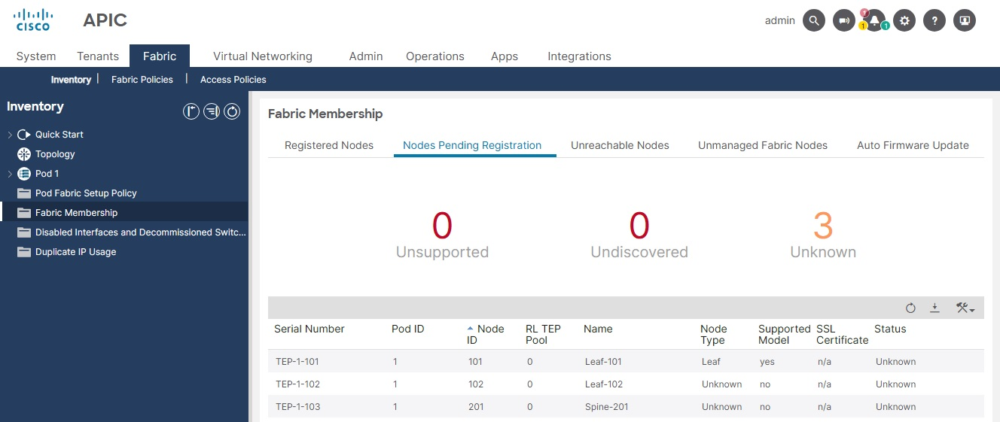
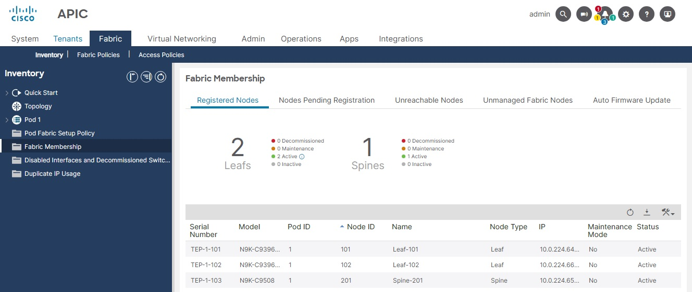

# Credit
- The original code is licensed under the BSD 3-Clause License.
- The original code is copyright (c) 2022, Osama Abbas
- The original code is available here:
https://github.com/Tes3awy/register-fabric-nodes

# Changes from Source
- Credit to the orginal creator added to all code files
- Uses CSV files instead of MS Excel files
- Requirements stripped down to just the "requests" module
- Updated screenshots for assets

# Register Nodes to ACI Fabric

> When you run the application, the system determines if the node exists and, if not, adds it. If the node exists, the system registers it.

> The application uses the `APIC-Challenge token` for a stronger API session security. To learn more about the challenge token, see [Requiring a Challenge Token for an API Session](https://www.cisco.com/c/en/us/td/docs/switches/datacenter/aci/apic/sw/2-x/rest_cfg/2_1_x/b_Cisco_APIC_REST_API_Configuration_Guide/b_Cisco_APIC_REST_API_Configuration_Guide_chapter_01.html#ariaid-title33).

## Table of Contents

1. [Directory Structure](#directory-structure)
2. [Overview](#overview)
3. [Fabric Node Discovery Statuses](#fabric-node-discovery-statuses)
4. [Installation](#installation)
5. [Register Fabric Nodes](#register-fabric-nodes)

## Directory Structure

The directory contains the following files:

```
│   main.py
│   apic.py
│   nodes.py
│   Fabric-Nodes.csv
|   requirements.txt
│   README.md
│   LICENSE
│   .gitignore
├───assets
│       apic_nodes.jpg
│       registered_nodes.jpg
└───
```

1. `apic.py` module contains the APIC functions to connect and have access to the APIC Controller.
2. `nodes.py` module contains the functions to read nodes to be registered and register those nodes.
3. `main.py` module contains the main function to run the application.
4. `Fabric-Nodes.csv` is a CSV file with nodes to be registered.

## Overview

After a switch/node is registered with the APIC, the switch is a part of the APIC-managed fabric inventory. With the
ACI fabric, the APIC is the single point of provisioning, management, and monitoring for switches in the infrastructure.

Switches in the `Nodes Pending Registration` tab table can have the following conditions:

- A newly discovered but unregistered node has a node ID of 0 and has no assigned IP address.
- A manually entered (in APIC) but unregistered switch has an original status of `Undiscovered` until it is physically connected to the network. Once connected, the status changes to `Discovered`.



**Note:** After the node ID is assigned, it cannot be updated/edited.

## Fabric Node Discovery Statuses

| Status       | Description                                             |
| ------------ | ------------------------------------------------------- |
| Unknown      | Node is discovered but no Node ID policy is configured. |
| Undiscovered | Node ID configured but is not yet discovered.           |
| Discovering  | Node is discovered but IP is not yet assigned.          |
| Unsupported  | Node is not a supported model.                          |
| Disabled     | Node has been decommissioned.                           |
| Inactive     | No IP connectivity.                                     |
| Active       | Node is active.                                         |

## Installation

### Option A

1. Download the repo from GitHub using `Code` button.
2. Unzip the repo.
3. Create a Python virtual environment and activate it.
4. Install requirements.

```powershell
register-fabric-nodes-main> python -m venv .venv --upgrade-deps
register-fabric-nodes-main> .\.venv\Scripts\Activate.ps1
register-fabric-nodes-main> python -m pip install wheel
register-fabric-nodes-main> python -m pip install -r requirements.txt
```

### Option B

1. Clone the repo from GitHub.
2. Create a Python virtual environment and activate it.
3. Install requirements.

```bash
$ git clone https://github.com/Tes3awy/register-fabric-nodes.git
$ cd register-fabric-nodes
$ python3 -m venv .venv --upgrade-deps
$ source .venv/bin/activate
$ python3 -m pip install wheel
$ python3 -m pip install -r requirements.txt
```

## Register Fabric Nodes

> A CSV file is already attached in the repo and is prepopulated with two leafs and a spine

> **For non Cisco partners, you can use the application with the [ACI Simulator 5.2](https://devnetsandbox.cisco.com/RM/Diagram/Index/740f912b-e9c8-4c7b-a1d7-691649dfa0dd) from Cisco DevNet Sandbox. (Requires reservation)**

Add your ACI fabric nodes to `Fabric-Nodes.csv`.

In `Node Type` column (Column A), you can select only one of the following _four_ valid node types:

1. `unspecified`
2. `tier-2-leaf`
3. `remote-wan-leaf`
4. `virtual`

> If you don't know which value to select from the `Node Type` column, choose `unspecified`.

In `Node Role` column (Column B), you can select only one of the following _three_ valid node roles:

1. `spine`
2. `leaf`
3. `unspecified`

After filling out all columns in `Fabric-Nodes.csv`, double check your entries and save the CSV file.



Finally, run the application.

**Windows**

```powershell
> py main.py
# or
> py -m main
```

**Nix or macOS**

```bash
$ python3 main.py
# or
$ python3 -m main
```

You will be prompted to enter CSV file, APIC URL, username, and password.

Example:

```bash
Nodes CSV file: Fabric-Nodes.csv
APIC IP Address: sandboxapicdc.cisco.com
Username: admin
Password:
```

> **Note:** After a successful run, the node is removed from the `Nodes Pending Registration` tab table to `Registered Nodes` tab table and you cannot by any means update/edit neither the `node type` nor the `node id`.

